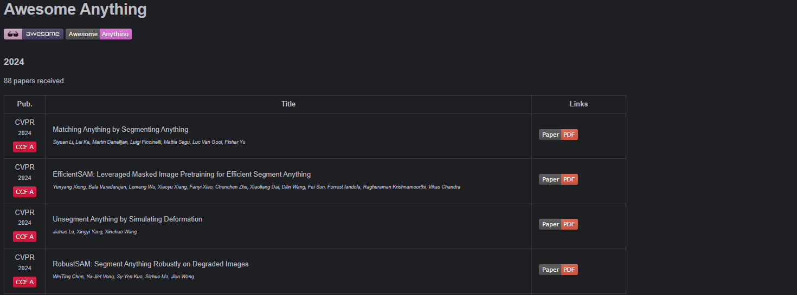
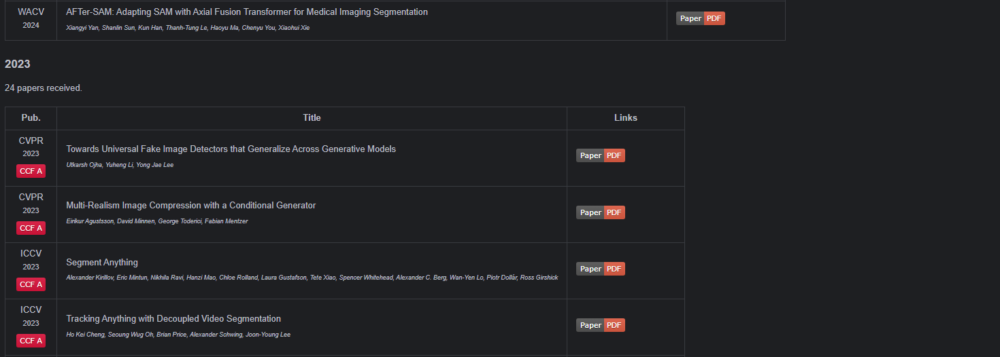
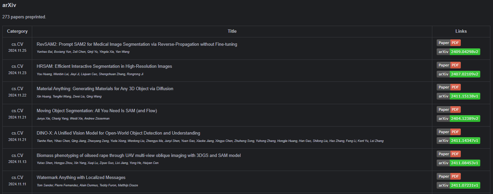

<div align="center">
<h1>Awesome Paper Collector</h1>

<a href="https://github.com/Yangzhichen763/Awesome-Paper-Collector"></a>
</div>

这个项目目前仅实现了简单的功能，其中包括
- **自动生成 Awesome 列表**：使用关键词爬取文章，并生成 Awesome md 文件
- **爬取文章作者**：通过单篇或多篇文章名，爬取文章作者（可选缩写作者名）
- **生成文章 md 文档**：输入论文的 arXiv 链接，爬取文章摘要和关键图片并生成 md 文档
- 敬请期待

点颗星星⭐支持一下~！啾咪(*´3`)❤~！

# 注意
爬取时<font color=red>记得开代理</font>，否则爬虫可能连文章网站（如 IEEE、AAAI 等）都进不去

# 环境配置
克隆本仓库到本地
```bash
git clone https://github.com/Yangzhichen763/Awesome-Papers-Collector.git
cd ReferenceEditor
```
安装依赖
```bash
pip install -r requirements.txt
```
---

# 使用方法
## 自动生成 Awesome 列表
通过关键词爬取文章，并生成 Awesome md 文件
```python
from core.awesome import awesome_search

# 要搜索的关键词
keyword = "Anything"

# 爬取文章并生成 Awesome md 文件
awesome_search.search(keyword)
```
目前支持的期刊和会议都在 `core/awesome/general.py` 文件下，可以支持检索的期刊和会议网站代码在 `core/awesome/pubs` 文件夹下。
任务列表如下：
- [x] 支持在 IEEE Xplore 中检索 IEEE 相关期刊和会议的论文
- [x] 支持在 ACM Digital Library 中检索 ACM 相关期刊和会议的论文
- [x] 支持在 OpenReview 中检索相关论文
- [x] 支持在 arXiv 中检索相关论文
- [x] 支持在 AAAI 中检索 AAAI 相关会议的论文
- [x] 支持在 NeurIPS 中检索 NeurIPS 相关会议的论文
- [ ] 支持在 ECCV 中检索 ECCV 相关会议的论文
- [ ] 支持在 Springer 中检索相关论文

生成的 Awesome md 文件部分展示结果如下：
<center>


...


...


</center>

## 筛除不符合条件的论文
通过关键词筛除论文标题中包含指定关键词的论文
```python
from core.awesome import awesome_search

# 要筛除的关键词
filter_keywords = ['NeRF', 'Gaussian Splatting', 'Neural Radiance Fields', 'Neural', 'Gaussian']

awesome_search.filter_title(filter_keywords)
```

# 其他功能

## 爬取文章作者

---
### 爬取单篇文章的作者
```python
from core import website_search

# 文章标题，或者能在搜索引擎中搜索到的关键词
title = "Attention is all you need"

# 检索文章作者
website_search.search_authors_by_title(title)
```
贴心小卫士:
- 可以通过更改 `reference_do.search_engine` 来切换搜索引擎
- 可以通过修改 `reference_do.num_pages` 来调整搜索结果数
### 爬取多篇文章的作者
```python
from core import website_search

# 文章标题列表，或者能在搜索引擎中搜索到的关键词列表
titles = ["Attention is all you need", "Latent Diffusion Model"]

# 检索文章作者
website_search.search_authors_by_title(titles)
```

## 生成文章 md 文档
### 根据 arXiv 链接生成文章 md 文档
```python
from core.arxiv_crawler import parse_arxiv_html

# 要生成的文章 arXiv 链接
url = "https://arxiv.org/abs/1706.03762"

# 爬取文章摘要并生成 md 文档
overview = parse_arxiv_html(url)
overview.make()
```
### 根据关键词生成文章 md 文档
```python
from core.arxiv_crawler import parse_arxiv_html
from core.website_search import search_urls_by_title

# 文章关键词
query = 'Attention is all you need'

# 爬取文章链接
urls = search_urls_by_title(query, "arXiv")

# 爬取文章摘要并生成 md 文档
for url in urls["arXiv"]:
    overview = parse_arxiv_html(url)
    overview.make()
```

---

# 敬请期待
更多功能正在开发中，敬请期待！

---

# 推荐工具
- 从 arXiv 引用生成信息全面的引用的简单工具: 
  - [(github) Rebiber: A tool for normalizing bibtex with official info.](https://github.com/yuchenlin/rebiber)
  - [(huggingface) Rebiber Hugging Face Demo](https://huggingface.co/spaces/yuchenlin/Rebiber)
